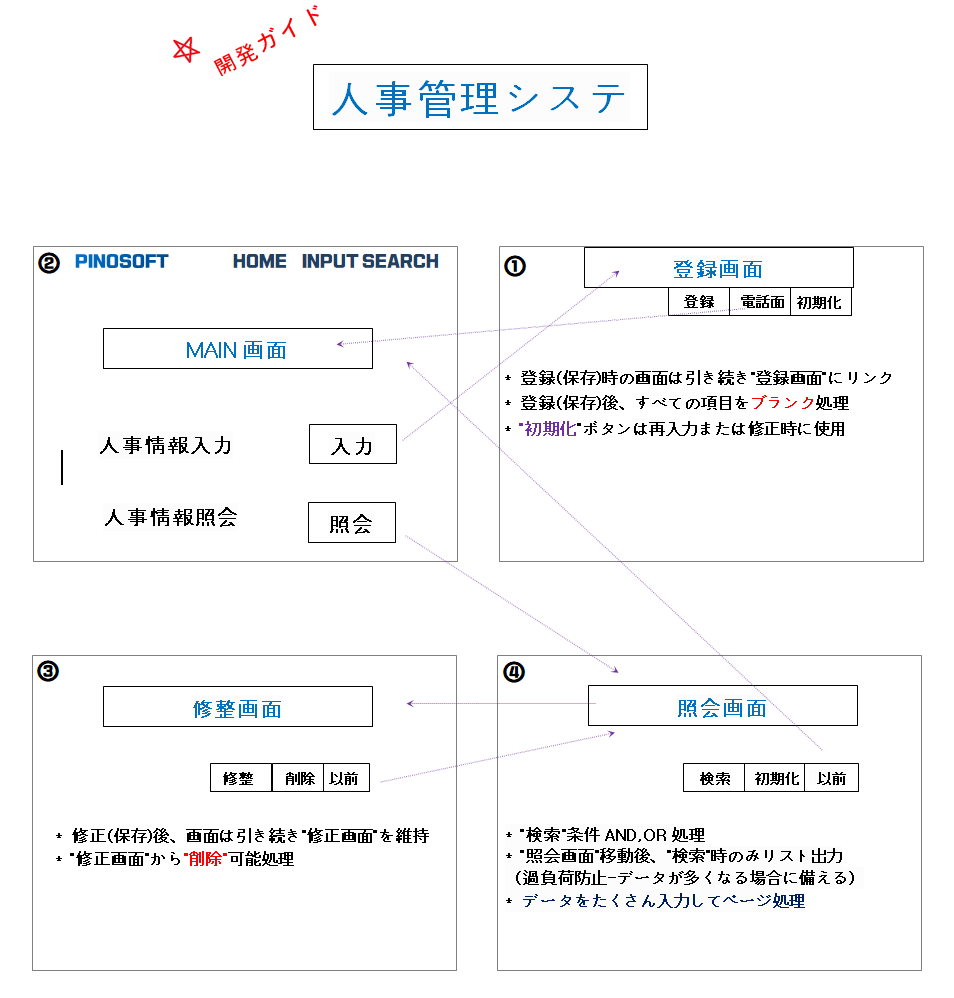
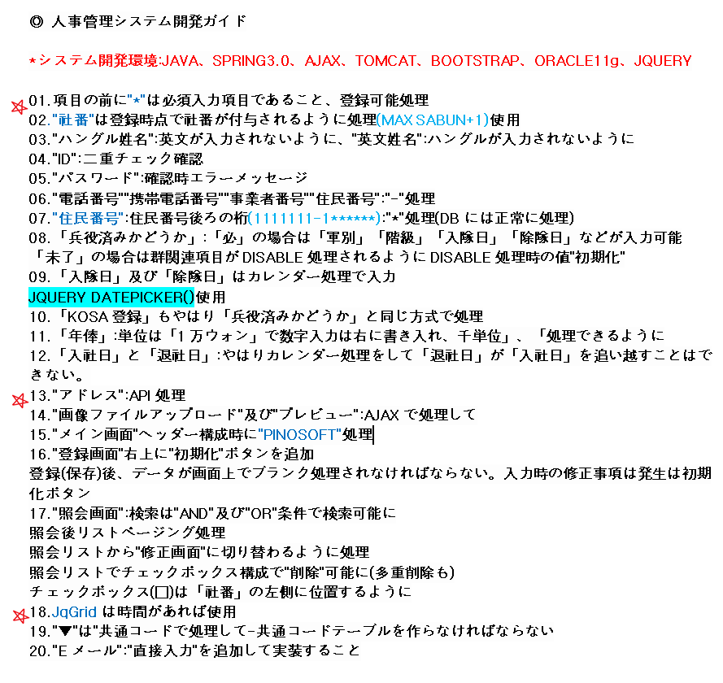
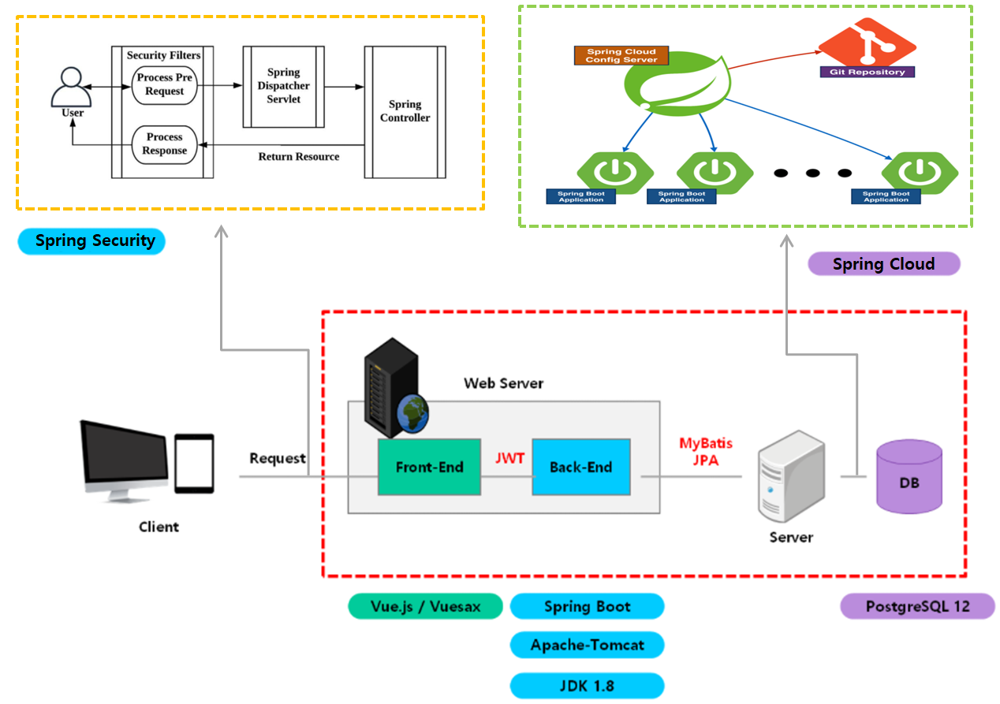

# ピノ人事システム

- <b>顧客会社</b>&nbsp;&nbsp;&nbsp;&nbsp;&nbsp;&nbsp;&nbsp;&nbsp;: 個人
- <b>参加期間</b>&nbsp;&nbsp;&nbsp;&nbsp;&nbsp;&nbsp;&nbsp;&nbsp;: 2021.11~2021.12(1ヵ月)
- <b>役割</b>&nbsp;&nbsp;&nbsp;&nbsp;&nbsp;&nbsp;&nbsp;&nbsp;&nbsp;&nbsp;&nbsp;&nbsp;&nbsp;&nbsp;&nbsp;: 企画、設計、開発
- <b>O.S</b>&nbsp;&nbsp;&nbsp;&nbsp;&nbsp;&nbsp;&nbsp;&nbsp;&nbsp;&nbsp;&nbsp;&nbsp;&nbsp;&nbsp;&nbsp;&nbsp; : Win
- <b>言語</b>&nbsp;&nbsp;&nbsp;&nbsp;&nbsp;&nbsp;&nbsp;&nbsp;&nbsp;&nbsp;&nbsp;&nbsp;&nbsp;&nbsp;&nbsp;: Java
- <b>DBMS</b>&nbsp;&nbsp;&nbsp;&nbsp;&nbsp;&nbsp;&nbsp;&nbsp;&nbsp;&nbsp;&nbsp;&nbsp;: Oracle
- <b>Tool</b>&nbsp;&nbsp;&nbsp;&nbsp;&nbsp;&nbsp;&nbsp;&nbsp;&nbsp;&nbsp;&nbsp;&nbsp;&nbsp;&nbsp;&nbsp;: Eclipse
- <b>Framework</b>&nbsp;&nbsp;&nbsp;&nbsp;: Spring
- <b>業務内容</b>&nbsp;&nbsp;&nbsp;&nbsp;&nbsp;&nbsp;&nbsp;&nbsp;: 元職員であるピノソフトに新入社員が入社すると人事プロジェクトを2週間実習することになるが、この部分に対する説明と完成モデルが必要で作られ、職員が派遣を各自が出ると装備を簡単に把握できるように機能を一緒に入れて作ったウェブサイトだ。 (http://www.pinoinsa.com/) 訪問用idはuser、pwは1234

&nbsp;&nbsp;&nbsp;
# プロジェクト概要
- &nbsp;&nbsp;&nbsp;
- &nbsp;&nbsp;&nbsp;
- &nbsp;&nbsp;&nbsp;

# プロジェクト試演
&nbsp;&nbsp;&nbsp;
